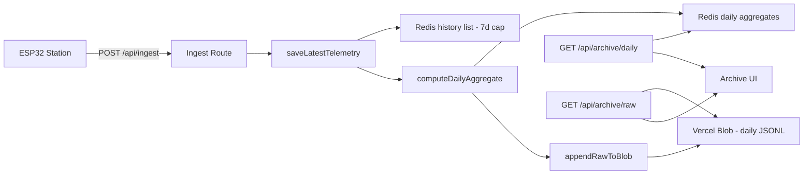

# Long-Term Weather Logging — Hybrid Architecture Plan

## Overview

Implement a hybrid approach for long-term weather data retention:
- **Daily aggregates in Redis** — fast queries for year/month/day charts (~365 records/year)
- **Raw telemetry export to Vercel Blob** — full-fidelity backup as JSONL files

## Architecture Diagram



## Data Model

### 1. Daily Aggregate Record

```typescript
type DailyAggregate = {
  date: string;              // "2026-05-22"
  year: number;              // 2026
  month: number;             // 5
  day: number;               // 22
  sampleCount: number;       // total samples for this day

  // Temperature
  tempMin: number | null;
  tempMax: number | null;
  tempAvg: number | null;

  // Humidity
  humidityMin: number | null;
  humidityMax: number | null;
  humidityAvg: number | null;

  // Pressure
  pressureMin: number | null;
  pressureMax: number | null;
  pressureAvg: number | null;

  // Wind Speed
  windSpeedMin: number | null;
  windSpeedMax: number | null;
  windSpeedAvg: number | null;

  // Wind Direction (avg)
  windDirAvg: number | null;

  // Solar
  solarMax: number | null;
  solarAvg: number | null;
  solarTotalWh: number | null;  // estimated energy (W * interval)

  // Battery
  batteryVoltageMin: number | null;
  batteryVoltageMax: number | null;
  batteryVoltageAvg: number | null;
  batteryPercentMin: number | null;
  batteryPercentMax: number | null;
  batteryPercentAvg: number | null;

  // Timestamps
  firstSampleAt: string;     // ISO timestamp of first sample
  lastSampleAt: string;      // ISO timestamp of last sample
};
```

### 2. Raw Telemetry Blob Files

```
weather-history/raw/YYYY/MM/DD.jsonl
```

Each line is a compact JSON object:
```json
{"t":"2026-05-22T08:00:00Z","temp":22.1,"hum":71,"pres":1015,"ws":3.1,"wd":180,"sol":0,"batV":13.2,"batPct":85}
```

## Redis Key Patterns

| Key | Type | Purpose | TTL |
|-----|------|---------|-----|
| `weatherstation:daily:YYYY-MM-DD` | String (JSON) | Daily aggregate record | 2 years |
| `weatherstation:daily:index:YYYY` | Set | Set of dates for a year | 2 years |
| `weatherstation:daily:index:YYYY-MM` | Set | Set of dates for a month | 2 years |
| `weatherstation:blob:raw:YYYY-MM-DD` | String | Blob URL/path for raw file | 2 years |

## Implementation Plan

### Phase 1: Daily Aggregation Core

#### Step 1.1: Add types in new file `src/lib/archive.ts`
- `DailyAggregate` type
- `DailyAggregateState` (running accumulator for current day)
- Helper functions: `extractSensorValues()`, `computeDailySummary()`

#### Step 1.2: Add Redis keys and storage functions in `src/lib/store.ts`
- `dailyAggregateKey(date)` — returns key string
- `dailyIndexKey(year)` — returns set key for year
- `dailyMonthIndexKey(year, month)` — returns set key for month
- `getDailyAggregate(date)` — fetch single day
- `getDailyAggregatesForMonth(year, month)` — fetch month
- `getDailyAggregatesForYear(year)` — fetch year
- `saveDailyAggregate(date, record)` — upsert daily record
- `getDailyAccumulator(date)` / `saveDailyAccumulator(date, state)` — running state

#### Step 1.3: Integrate aggregation into `saveLatestTelemetry()`
- Extract sensor values from incoming payload
- Update running accumulator for current day
- On midnight boundary (or every N samples), flush accumulator to daily record
- Add date to year/month index sets

### Phase 2: Raw Telemetry Export to Vercel Blob

#### Step 2.1: Add raw export function in `src/lib/store.ts`
- `appendRawTelemetryToBlob(payload)` — appends compact JSON line to daily blob
- Strategy: Buffer lines in memory (Redis list), flush to blob at midnight or every 100 samples
- Key: `weatherstation:raw:buffer:YYYY-MM-DD` (Redis list)
- Flush: `weatherstation:raw:flush:YYYY-MM-DD` triggers blob upload

#### Step 2.2: Blob file naming
- Path: `weather-history/raw/YYYY/MM/DD.jsonl`
- Access: private
- Upload via `put()` from `@vercel/blob`

### Phase 3: API Endpoints

#### Step 3.1: `GET /api/archive/daily?year=&month=&day=`
- Optional params: year (required), month (optional), day (optional)
- Returns: array of `DailyAggregate` records
- If day specified: single record
- If month specified: all days in month
- If only year: all days in year

#### Step 3.2: `GET /api/archive/raw?date=YYYY-MM-DD`
- Returns: URL to download raw JSONL file from Vercel Blob
- Or streams the file content directly

#### Step 3.3: `GET /api/archive/stats?year=`
- Returns: yearly summary (annual min/max/avg, total samples, etc.)

### Phase 4: Archive UI

#### Step 4.1: New page `src/app/archive/page.tsx`
- Year selector (dropdown)
- Month selector (dropdown, optional)
- Day selector (calendar grid, optional)
- Chart area showing daily aggregates

#### Step 4.2: `src/app/archive/archive-client.tsx`
- Fetches daily aggregates from `/api/archive/daily`
- Renders bar/line chart with daily min/max/avg
- Color-coded by temperature bands
- Stats panel: monthly/yearly summaries

#### Step 4.3: Navigation link in header
- Add "Archive" link alongside Dashboard, History, Admin

## Aggregation Algorithm

```
On each telemetry POST:
  1. Extract date from receivedAt
  2. Load accumulator for that date
  3. Update running min/max/sum/count for each sensor
  4. Save accumulator back
  5. If accumulator crosses midnight boundary:
     a. Compute final averages from sums/counts
     b. Save as DailyAggregate record
     c. Add date to year/month index sets
     d. Reset accumulator for new date
  6. Every 100 samples: flush raw buffer to Vercel Blob
```

## Sensor Value Extraction

Extract from `displays[]` array using label/unit matching (reuse logic from `insights.ts`):

| Sensor | Label Match | Unit Match |
|--------|-------------|------------|
| Temperature | "temp", "temperature" | "°c", "°f" |
| Humidity | "humid", "rh" | "%" |
| Pressure | "pres", "pressure" | "hpa", "mb" |
| Wind Speed | "wind", "wind spd" | "m/s", "km/h" |
| Wind Direction | "wind dir" | "deg" |
| Solar | "solar" | "W" |
| Battery Voltage | "battery", "bat" | "V" |
| Battery Percent | "bat lvl", "battery level" | "%" |

## File Structure (New Files)

```
src/
├── lib/
│   └── archive.ts              # Daily aggregate types + extraction logic
├── app/
│   ├── archive/
│   │   ├── page.tsx            # Archive page wrapper
│   │   └── archive-client.tsx  # Archive UI component
│   └── api/
│       └── archive/
│           ├── daily/
│           │   └── route.ts    # GET daily aggregates
│           ├── raw/
│           │   └── route.ts    # GET raw telemetry blob
│           └── stats/
│               └── route.ts    # GET yearly stats
```

## Migration & Backward Compatibility

- Existing history list (7-day cap) remains unchanged
- Daily aggregation starts from first POST after deployment
- No retroactive data for past days
- Raw blob export starts fresh

## Cost Estimates

| Resource | Usage | Est. Cost |
|----------|-------|-----------|
| Redis keys | ~365 daily + ~365 accumulators + index sets | Negligible |
| Vercel Blob | ~1KB/sample × 1440/day × 365 = ~520MB/year | ~$0.50/month |
| Redis ops | +2-4 ops per ingest POST | Negligible |

## Risks & Mitigations

| Risk | Mitigation |
|------|-----------|
| Accumulator lost on serverless cold start | Store accumulator in Redis, not memory |
| Blob upload fails silently | Retry with exponential backoff, log errors |
| Memory bloat from large accumulators | Cap accumulator at 2000 samples, flush early |
| Timezone issues with midnight boundary | Use UTC consistently, store `receivedAt` in UTC |
